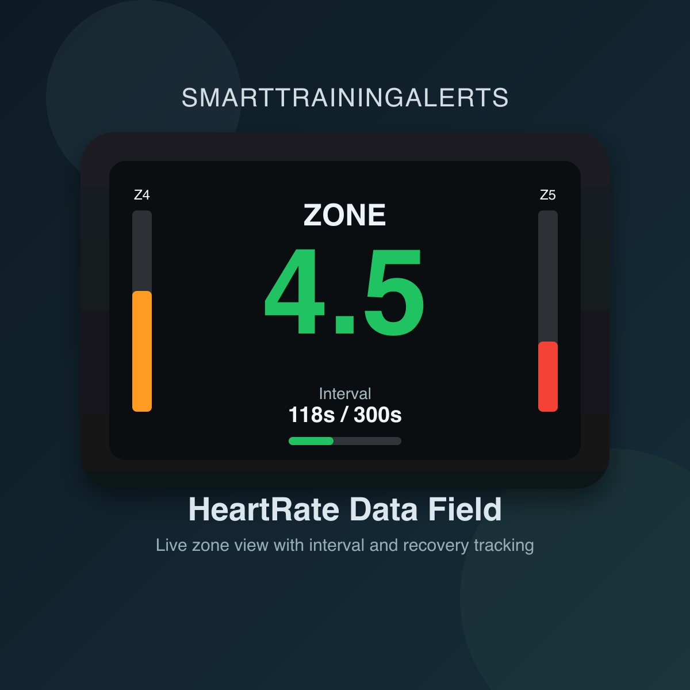

# SmartTrainingAlerts (Connect IQ v8)

Two **Data Fields**, provided as separate projects:
- **PowerCadenceField** — alerts based on power/cadence conditions.
- **HeartRateField** — alerts based on heart‑rate zone durations.

This project has been **tested with Garmin Connect IQ SDK 8.4.1 on Ubuntu 22.04**, deploying to a **Garmin Edge 1050**.

---

## 🔧 Development Environment Setup

### Requirements
- Visual Studio Code
- Monkey C Extension (Garmin)
- Garmin Connect IQ SDK **8.4.1**
- At least one device installed in SDK Manager (e.g., Edge 1050)

### Install
1. Install the **Garmin Connect IQ SDK Manager**:  <https://developer.garmin.com/connect-iq/sdk/>
2. Use SDK Manager to install:
   - SDK 8.4.1
   - Edge 1050 device profile
3. Install Visual Studio Code
4. Install the **Monkey C** extension (Garmin)
5. Run:
   ```
   Ctrl + Shift + P → Monkey C: Verify Installation
   ```

---

## 📂 Project Structure
Each datafield is a separate project:

```
SmartTrainingAlerts_PowerCadence/
SmartTrainingAlerts_HeartRate/
```

Each project contains:
- `manifest.xml` — schema v3, validated
- `monkey.jungle`
- `source/` — your Monkey C code
- `resources/` — icons, strings, settings

---

## 🛠 Build the Project
In Visual Studio Code:

```
Ctrl + Shift + B
```

Or:
```
Ctrl + Shift + P → Monkey C: Build for Device
```

A `.prg` file will be created in:
```
bin/
```

---

## 🚀 Deploy to Your Garmin Device (Edge 1050)
There are **two supported deployment methods**:

### ✔ Method 1 — Deploy Directly from VS Code (recommended)
1. Connect your Garmin Edge 1050 via USB
2. In VS Code:
   ```
   Ctrl + Shift + P → Monkey C: Build for Device
   ```
3. Select the **Edge 1050**
4. VS Code automatically copies the `.prg` into:
   ```
   GARMIN/APPS/
   ```
5. Disconnect and restart the device
6. Add the Data Field under:
   ```
   Activity Profile → Data Screens → Connect IQ Fields
   ```

### ✔ Method 2 — Manual Install via USB (Sideloading)

> ⚠️ **macOS only**: macOS does not support the Garmin Edge as a USB drive natively.  
> You need to install **Android File Transfer**: <https://www.android.com/filetransfer/>

1. Install **Android File Transfer** on your Mac (see link above)
2. Build the project → get `.prg` from `bin/`
3. Connect the Edge 1050 via USB
4. Open **Android File Transfer** — it shows the Garmin file system
5. Navigate to:
   ```
   GARMIN/Apps/
   ```
6. Drag and drop your `.prg` file into that folder
7. Disconnect and restart the device

> ⚠️ **Settings not available with sideloading** — see the [Configure Settings](#️-configure-settings-edge-ui-or-connect-iq-app) section below.

---

## ⚙ Configure Settings (Edge UI or Connect IQ App)
Settings are defined in:
```
resources/settings/settings.xml
```

> ⚠️ **Important: Sideloaded apps (.prg) do NOT support settings**
>
> If you install the app by manually copying a `.prg` file to `GARMIN/APPS/`, the settings screen will **not** appear in Garmin Connect or on the Edge itself.  
> Settings only work when the app is installed via the **Connect IQ developer portal** (even as a private beta).

### Update Settings While Sideloading (workaround)

When sideloading, Garmin keeps app properties persistent on the device. That means changing `properties.xml` from `100` to `90` does **not** automatically overwrite the already stored value.

This project now includes a sideload reset mechanism in `source/Settings.mc` for both apps.

1. Change the sideload defaults in:
   - `PowerCadence/source/Settings.mc`
   - `HeartRate/source/Settings.mc`
2. Bump the schema version constant in the same file:
   - `PC_SETTINGS_SCHEMA_VERSION`
   - `HR_SETTINGS_SCHEMA_VERSION`
3. Build again (`.prg` for sideload, or `.iq` if you also want a package).
4. Replace the app file on the device (`GARMIN/Apps/`) with the new build.

At first launch after a schema version bump, the app overwrites the old stored values with the new sideload defaults.

If you only change `resources/settings/properties.xml`, that mainly affects first install / portal-managed settings, but it will not reliably replace already persisted sideloaded values.

This workaround is useful for testing, but for real end-user settings updates use portal install (Beta/Store).

### Alternative for Development: settings JSON in Simulator

There is also a **settings JSON** workflow, but this is for the **Connect IQ simulator / VS Code debug flow**, not for uploading a settings file to a sideloaded Edge device.

Use these files:

- `PowerCadence-settings.json`
- `HeartRate-settings.json`

How to use it:

1. Edit the JSON file for the app you want to test.
2. Start the app in the Connect IQ simulator from VS Code.
3. The simulator loads those settings and the app starts with those values.

Important:

- This is useful for local development and testing.
- This does **not** provide a supported way to update settings on a physically sideloaded Edge 1050.
- For a real device with editable settings, use Garmin beta/portal install.

---

### ✅ Recommended: Upload as Beta via Developer Portal

To get full settings support, upload your app as a private beta:

1. Go to [apps.garmin.com/developer/dashboard](https://apps.garmin.com/developer/dashboard) and log in
2. Click **Create an App**, fill in name and category (**Data Field**), add Edge 1050 as supported device
3. Build a `.iq` package from the command line:
   ```
   "/Users/erwinrademakers/Library/Application Support/Garmin/ConnectIQ/Sdks/connectiq-sdk-mac-8.4.1-2026-02-03-e9f77eeaa/bin/monkeyc" -e -o bin/HeartRate.iq -f monkey.jungle -y /Users/erwinrademakers/MonkeyC/developer_key -d edge1050 -r
   ```
4. Upload the `.iq` file in the portal under **Beta Testing**
5. Click **Publish Beta** — you receive a private install link
6. Open the link on your phone → **Send to device** → sync your Edge
7. Settings are now available via Garmin Connect app:

```
My Device → Connect IQ Apps → HeartRate / PowerCadence → Settings
```

### 📱 Install Beta via iPhone + Connect IQ app

If install from Garmin Connect IQ fails, this is the most reliable iPhone flow.

1. Build your app first:
   - Quick test build (`.prg`):
     ```
     Ctrl + Shift + P → Monkey C: Build for Device
     ```
   - Portal upload build (`.iq`):
     ```
     cd /Users/erwinrademakers/workspace/SmartTrainingAlerts/HeartRate
     "/Users/erwinrademakers/Library/Application Support/Garmin/ConnectIQ/Sdks/connectiq-sdk-mac-8.4.1-2026-02-03-e9f77eeaa/bin/monkeyc" -e -o bin/HeartRate.iq -f monkey.jungle -y /Users/erwinrademakers/MonkeyC/developer_key -d edge1050 -r
     ```
     (Use the equivalent command in `PowerCadence/` for PowerCadence.)
2. Upload the `.iq` in Garmin Developer Portal → your app → **Beta Testing**.
3. Click **Publish Beta** and copy/open the beta install link.
4. On your iPhone (where Connect IQ is installed), open:
   [apps.garmin.com/developer/dashboard](https://apps.garmin.com/developer/dashboard)
5. Open your app page and tap the install/open link. iOS should offer **Open in Connect IQ**.
6. Confirm install in the Connect IQ app and select your Edge 1050.
7. Make sure the Edge 1050 is powered on and synced in Garmin Connect.
8. Wait for sync to complete, then verify on device:
   ```
   Activity Profile → Data Screens → Connect IQ Fields
   ```

Troubleshooting:
- Remove old sideloaded `.prg` of the same app before beta install.
- If installation still fails, republish beta and open the latest install link again.

---

### ✔ On the Edge 1050 (on‑device settings, only when installed via portal)
```
Activity Profile → Data Fields → Connect IQ → SmartTrainingAlerts_* → Settings
```

### ✔ Using the Connect IQ mobile app (only when installed via portal)
```
My Device → Activities & Apps → Data Fields → SmartTrainingAlerts_* → Settings
```

---

## � Build .iq Package

A `.iq` file is required for uploading to the Garmin developer portal (beta or public).  
It is built via the `monkeyc` command line tool.

**SDK location on macOS:**
```
~/Library/Application Support/Garmin/ConnectIQ/Sdks/connectiq-sdk-mac-8.4.1-2026-02-03-e9f77eeaa/bin/monkeyc
```

### Step 1 — Use your existing developer key

Use your existing key from:
```
/Users/erwinrademakers/MonkeyC/developer_key
```

If your key file has another name (for example `.der`), use that full file path with `-y`.  
> ⚠️ Keep this key safe — you must use the **same key** for every future update, otherwise Garmin treats it as a new app.

### Step 2 — Build the .iq package

**HeartRate:**
```bash
cd /Users/erwinrademakers/workspace/SmartTrainingAlerts/HeartRate

"/Users/erwinrademakers/Library/Application Support/Garmin/ConnectIQ/Sdks/connectiq-sdk-mac-8.4.1-2026-02-03-e9f77eeaa/bin/monkeyc" \
   -e \
  -o bin/HeartRate.iq \
  -f monkey.jungle \
   -y /Users/erwinrademakers/MonkeyC/developer_key \
  -d edge1050 \
  -r
```

**PowerCadence:**
```bash
cd /Users/erwinrademakers/workspace/SmartTrainingAlerts/PowerCadence

"/Users/erwinrademakers/Library/Application Support/Garmin/ConnectIQ/Sdks/connectiq-sdk-mac-8.4.1-2026-02-03-e9f77eeaa/bin/monkeyc" \
   -e \
  -o bin/PowerCadence.iq \
  -f monkey.jungle \
   -y /Users/erwinrademakers/MonkeyC/developer_key \
  -d edge1050 \
  -r
```

The `-e` flag creates an app package (`.iq`) for portal upload. The `-r` flag builds a release (optimized) package. The `.iq` file is created in `bin/`.

### Step 3 — Upload to developer portal
1. Go to [apps.garmin.com/developer/dashboard](https://apps.garmin.com/developer/dashboard)
2. Open or create your app
3. Go to **Beta Testing** → upload the `.iq` file
4. Click **Publish Beta** → you receive a private install link
5. Open the link on your phone → **Send to device** → sync your Edge

---

## �📸 Screenshots
Place images in an `/images` folder and reference them like:
```markdown



```

---
